# PROJECT_VIVINO


## Project Description
Vivino is the world’s largest online wine marketplace and most downloaded wine app with a reliable online community is made up of millions of wine drinkers from around the world, coming together to make buying the right wine simple, straightforward, and fun by utilizing crowd-sourced data to personalize wine recommendations so that every community member feels confident about their wine choices.

This project is aimed to provide an interactive analysis of vivino market segmentation. The project is built on top of the provided dataset, which can be retrieved from [this link](https://drive.google.com/file/d/122rj3-c0mpFPL04IXeXjSp2_H66-33RS/view?usp=sharing). 

## Folder Structure
```bash
project_vivino
├── data
│   ├── vivino_database.accdb
│   └── vivino_db.mdb
│   └── vivino.db    
├── notebooks
│   ├── vivino_market_analysis.ipynb
├── output
│   ├── Parameters.pdf
│   └── price_dist_provinces.png
├── src
│   └── vivino_streamlit.py
├── .gitignore
├── LICENSE
├── README.md
└── requirements_vivino.txt
```

## Installation

To set up the project locally, follow these steps:

1. Clone the repository: `git clone https://github.com/mfirdaus354/project_vivino.git`
2. Change into the project directory: `cd project_vivino`
3. Install the required dependencies: `pip install -r requirements_vivino.txt`

## Usage

To use the project, follow these steps:

1. Ensure the dependencies are installed (see [Installation](#installation)).
2. In order to run the streamlit app, execute this following command in a Terminal window

        
        python -m streamlit run ./src/vivino_streamlit.py
        

3. The analysis of the dataset is accesible by opening the vivino_market_analysis.ipynb in the notebooks folder

## INSIGHTS

#### TABLEAU DASHBOARD

.png).

### QUESTION 1
We want to highlight 10 wines to increase our sales. Which ones should we choose and why?
- Those with good ratings but not a big amount of ratings
- Natural wines?

5 Natural European wines with the highest rating and reviews

 

Natural wines are wines made without chemical additives, such as tannin. We think that enjoying wine should not jeaopardize your health. Therefore, we recommend the wines listed above because those wines are natural, European Wines substantiated with a solid customer reviews and rating.

5 vintage Wines with the highest rating and reviews

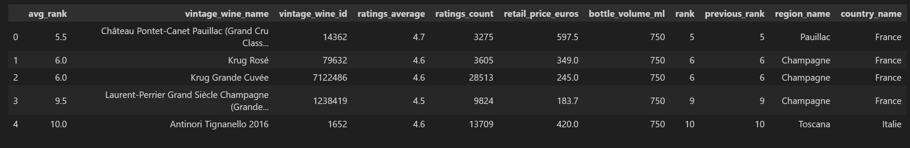

We recommend these vintage wines due to the fact that they have been consistently marking their place in our vintages_toplists_rankings table throughout multiple years, and their positions are substantiated with a significant amount of ratings and overall average rating score.

### QUESTION 2
We have a marketing budget for this year. Which country should we prioritise and why?
- Those with high user count?
- those we low user count?
- Those with a upcoming user popularity

Top 3 countries with the highest user count

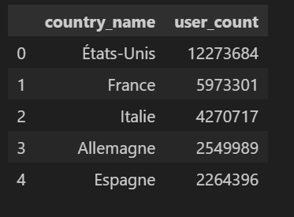

Country leaderboard based on ratings count

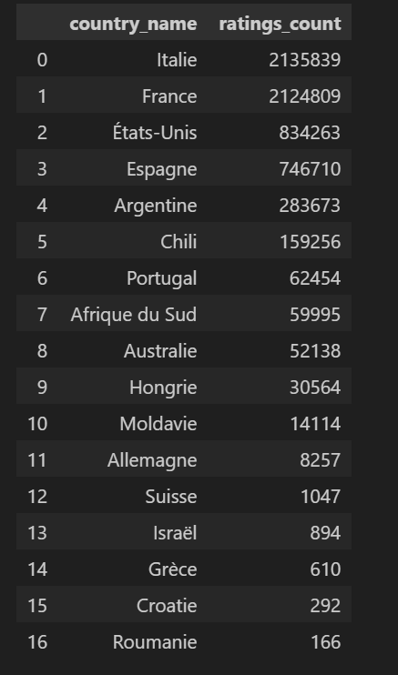

Based on the information above, we suggest to focus the marketing resources on establishing customer base in these following countries 
 1. Italy (listed as Italie)
 2. France (listed as France)
 3. Spain (listed as Espagne)
 4. United States of America (listed as États-Unis)
 5. Germany (listed as Allemagne)

## QUESTION 3
We have detected that a big cluster of customers like a specific combination of tastes.
We have identified a few primary keywords that match this.
We would like you to find all the wines that have those keywords. 
To ensure the accuracy of our selection, ensure that more than 10 users confirmed those keywords.
 Also, identify the group_name related to those keywords. 
 - coffee
- toast
- green apple
- cream
- citrus

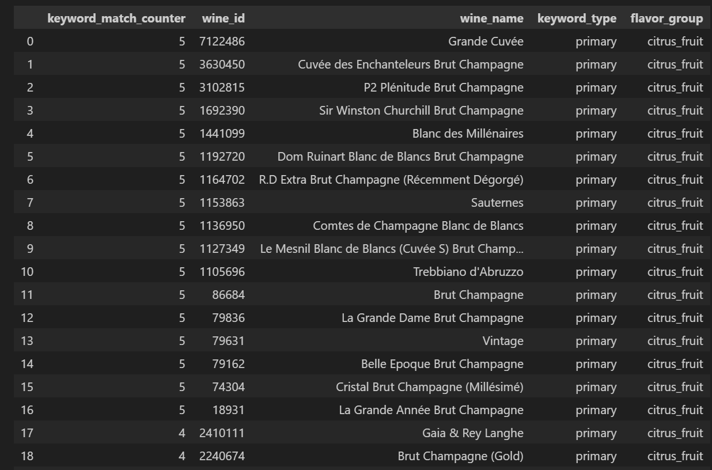

- 'keyword_match_counter' column acts as an indicator that suggests the matched wines that fulfills all of the requested 'flavor_key'
- The requested 'flavor_key' are: 'coffee', 'toast', 'green apple', 'cream', 'citrus'
- The requested 'flavor_key' belongs to 'citrus_fruit' 'flavor_group'

## QUESTION 4
We would like to select wines that are easy to find all over the world. 
1. Find the top 3 most common grape all over the world 
2. For each grape, give us the the 5 best rated wines.

Top 3 most common grape all over the world 

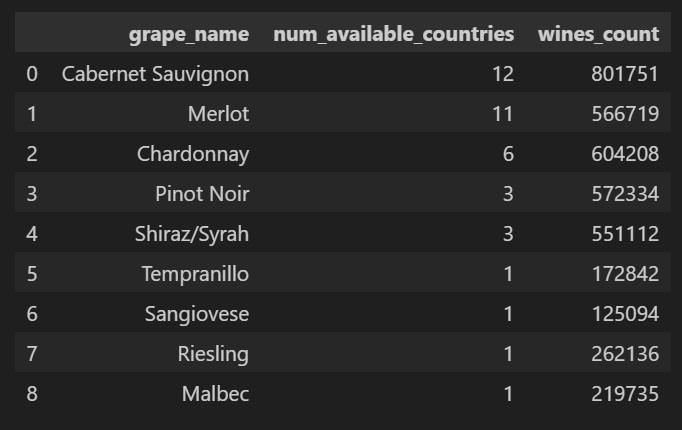

Top 5 Cabernet Sauvignon wines

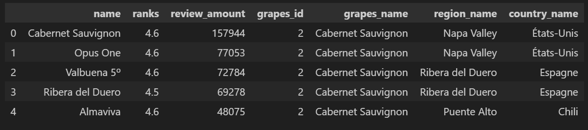

Top 5 Merlot wines

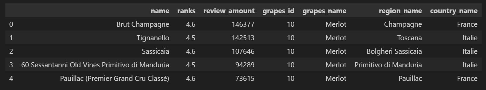

Top 5 Chardonnay wines

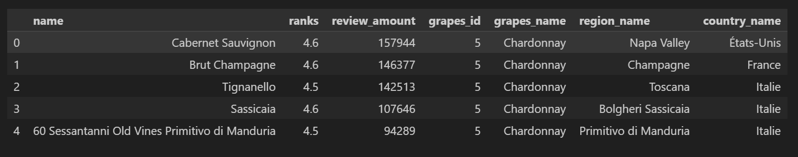

## QUESTION 5
We would to give create a country leaderboard.
Give us a visual that shows the average wine rating for each country.

Country leaderboard based on average rating number of wines

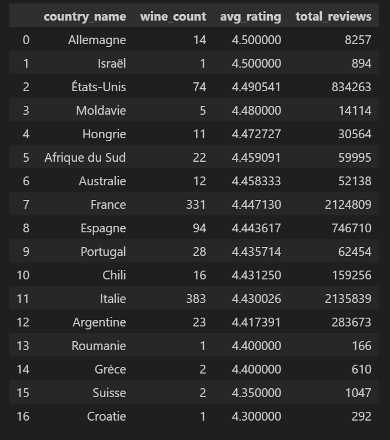

Country leaderboard based on average rating and number of vintage wines

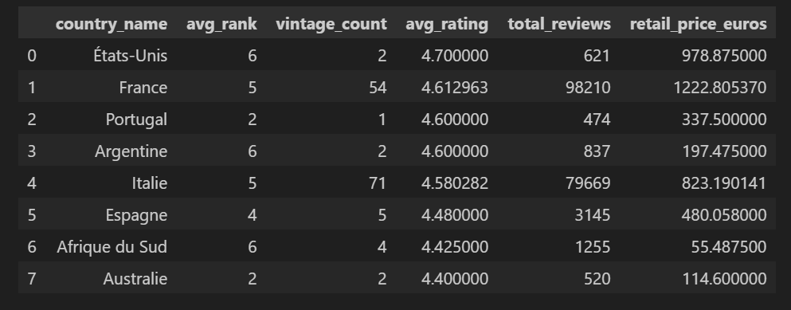

Country Leaderboard Cloropleth Map

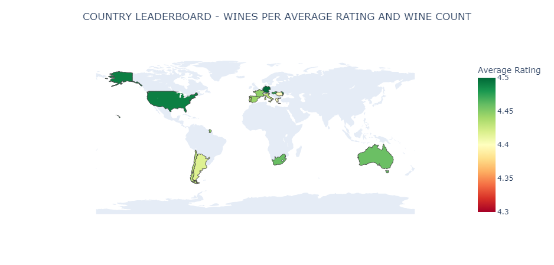

        THE AWARD GOES TO:
        1. France
        2. Italy
        3. Spain

        HONORAABLE MENTION:
        1. United States of America
        2. Argentina
        3. Chile
        4. Germany


